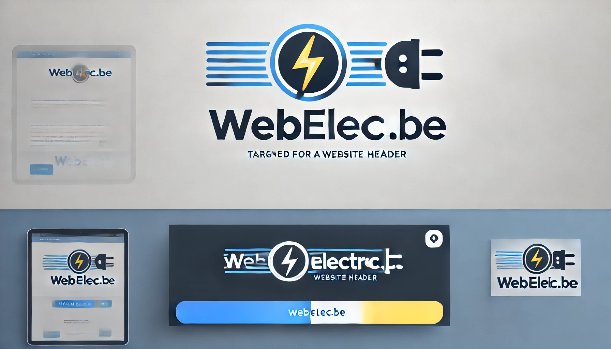

# 🔋 Monitoring Énergétique Next.js

Application web de surveillance en temps réel des données énergétiques pour systèmes IoT (Raspberry Pi, ESP32) utilisant Next.js 15, TypeScript et Recharts.

## � Aperçu du Projet

Cette application permet de monitorer et visualiser en temps réel des données électriques provenant de capteurs IoT. Elle offre une interface moderne et responsive pour le suivi de la tension, du courant et de la puissance électrique.

## ✨ Fonctionnalités Principales

### 📈 Visualisation en Temps Réel

- **Graphiques interactifs** avec Recharts pour la visualisation des données
- **Mise à jour automatique** des données toutes les secondes
- **Historique des mesures** avec affichage des 5 dernières valeurs
- **Interface responsive** compatible mobile et desktop

### ⚡ Monitoring Électrique

- **Contrôle d'intensité** : Mesure et affichage du courant électrique
- **Contrôle de tension** : Surveillance de la tension en temps réel
- **Calcul de puissance** : Calcul automatique de la puissance (P = U × I)
- **Simulation de données** : Mode démo avec génération de données aléatoires

### 🌐 Communication IoT

- **API WebSocket** pour communication en temps réel
- **Support ESP32** : Communication avec microcontrôleurs ESP32
- **API REST** : Endpoints pour récupération de données énergétiques
- **Mode serveur externe** : Connexion à serveur de données externe (port 5000)

## 🛠️ Technologies Utilisées

### Frontend

- **Next.js 15** - Framework React avec App Router
- **TypeScript** - Typage statique pour JavaScript
- **Tailwind CSS** - Framework CSS utilitaire
- **Recharts** - Bibliothèque de graphiques pour React
- **React Icons Kit** - Icônes vectorielles

### Backend & Communication

- **WebSocket (ws)** - Communication bidirectionnelle en temps réel
- **Axios** - Client HTTP pour les requêtes API
- **Next.js API Routes** - Endpoints backend intégrés

### Outils de Développement

- **ESLint** - Linter JavaScript/TypeScript
- **PostCSS** - Processeur CSS
- **Turbopack** - Bundler ultra-rapide (mode dev)

## 📦 Installation et Configuration

### Prérequis

- Node.js 18+
- npm ou yarn
- Git

### Installation

```bash
# Cloner le repository
git clone <votre-repo>
cd demo-intensite

# Installer les dépendances
npm install

# Démarrer en mode développement
npm run dev
```

### Scripts Disponibles

```bash
# Développement avec Turbopack
npm run dev

# Build de production
npm run build

# Démarrer en production
npm run start

# Linter le code
npm run lint
```

## 🏗️ Architecture du Projet

```
src/
├── app/                    # App Router Next.js 15
│   ├── api/socket/        # API WebSocket
│   ├── globals.css        # Styles globaux
│   ├── layout.tsx         # Layout principal
│   └── page.tsx           # Page d'accueil
├── components/            # Composants React
│   ├── card.tsx          # Composant Card réutilisable
│   ├── controle-intensite.tsx    # Monitoring intensité
│   ├── controle-tension.tsx      # Monitoring tension
│   ├── EnergyDataFetcher.tsx     # Récupération données temps réel
│   ├── EnergyDataSimulator.tsx   # Simulation de données
│   ├── energy-data.tsx           # Affichage données serveur
│   └── header-logo.tsx           # En-tête avec logo
└── tools/
    └── getDataAleatoire.ts       # Génération données aléatoires
```

## 🚀 Fonctionnement

### 1. Interface Principal

L'application présente un tableau de bord avec plusieurs cartes :

- **Contrôle Intensité** : Graphique linéaire du courant
- **Données Temps Réel** : Fetcher de données en temps réel
- **Contrôle Tension** : Monitoring de la tension
- **Simulateur** : Génération de données de test

### 2. Communication avec ESP32

```typescript
// Exemple d'envoi de données ESP32
POST /api/socket
{
  "ip": "192.168.1.100",
  "valeur": "230.5V",
  "timestamp": "2024-01-01T12:00:00Z"
}
```

### 3. Structure des Données

```typescript
interface ElectricityData {
  timestamp: string;  // ISO timestamp
  voltage: number;    // Tension en Volts
  current: number;    // Courant en Ampères
  power: number;      // Puissance en Watts
}
```

## 🔧 Configuration

### Variables d'Environnement

Créez un fichier `.env.local` :

```env
# URL du serveur de données externe
NEXT_PUBLIC_API_URL=http://localhost:5000

# Configuration WebSocket
NEXT_PUBLIC_WS_URL=ws://localhost:3001
```

### Connexion Serveur Externe

L'application peut se connecter à un serveur externe sur le port 5000 :

```bash
# Assurez-vous qu'un serveur fonctionne sur :
http://localhost:5000/api/energy-data
```

## 📱 Utilisation

1. **Démarrage** : `npm run dev` puis ouvrir <http://localhost:3000>
2. **Mode Simulation** : Les données sont générées automatiquement
3. **Connexion IoT** : Configurer votre ESP32 pour envoyer vers `/api/socket`
4. **Monitoring** : Visualiser les graphiques en temps réel

## � Configuration

### Variables d'Environnement
Créez un fichier `.env.local` :
```env
# URL du serveur de données externe
NEXT_PUBLIC_API_URL=http://localhost:5000

# Configuration WebSocket
NEXT_PUBLIC_WS_URL=ws://localhost:3001
```

### Connexion Serveur Externe
L'application peut se connecter à un serveur externe sur le port 5000 :
```bash
# Assurez-vous qu'un serveur fonctionne sur :
http://localhost:5000/api/energy-data
```

## 📱 Utilisation

1. **Démarrage** : `npm run dev` puis ouvrir http://localhost:3000
2. **Mode Simulation** : Les données sont générées automatiquement
3. **Connexion IoT** : Configurer votre ESP32 pour envoyer vers `/api/socket`
4. **Monitoring** : Visualiser les graphiques en temps réel

## 🎯 Cas d'Usage

- **Domotique** : Surveillance consommation électrique domestique
- **IoT Industriel** : Monitoring de machines et équipements
- **Recherche** : Collecte de données pour analyses énergétiques
- **Formation** : Démonstration de concepts électriques

## 🤝 Contribution

1. Fork le projet
2. Créer une branche feature (`git checkout -b feature/AmazingFeature`)
3. Commit les changes (`git commit -m 'Add some AmazingFeature'`)
4. Push vers la branche (`git push origin feature/AmazingFeature`)
5. Ouvrir une Pull Request

## 📄 Licence

Ce projet est sous licence MIT - voir le fichier [LICENSE](LICENSE) pour plus de détails.

## 🔮 Roadmap

- [ ] Authentification utilisateur
- [ ] Base de données persistante
- [ ] Alertes et notifications
- [ ] Export de données (CSV, JSON)
- [ ] Support MQTT
- [ ] Dashboard administrateur
- [ ] API mobile (React Native)

## 💡 Support

Pour toute question ou problème :
- Ouvrir une issue sur GitHub
- Consulter la documentation technique
- Contacter l'équipe de développement

---

<div align="center">
  
  
  **Développé avec ❤️ pour l'IoT et le monitoring énergétique**
</div>
